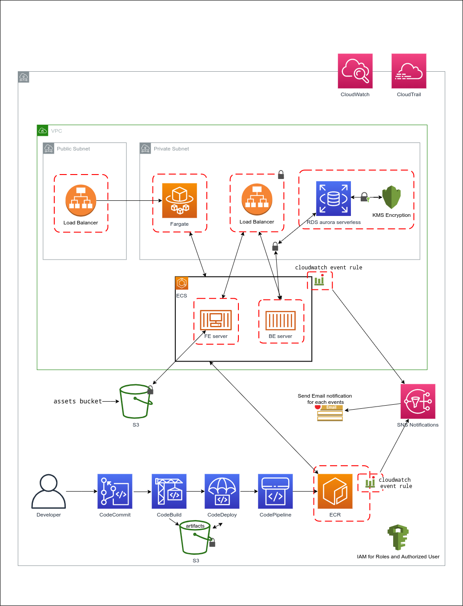

# AWS Terraform Setup
The setup includes following modules which are configurable.

- VPC
- ECS Fargate
- Application Load Balancer
- Aurora MySQL Serverless
- RDS MySQL
- CodeCommit, CodeBuild, CodePipeline 
- ECR
- CloudWatch Alarms
- S3 Bucket
- CloudTrail

## NodeJS Applications
* [Web Server](./source/terraform-demo-server/fe-server) is a simple NodeJS/Express application which internally uses the App Server to process incoming requests.
* [App Server](./source/terraform-demo-server/be-server) is a middle application which accepts requests from the Web server and connects with the AWS Aurora database for all the database communication. 

## Terraform Environment Variables
[sample.terraform.tfvars](./sample.terraform.tfvars) has all the required environment variables required for the terraform setup. Rename the file and apply the desired values before running the `terraform plan/apply`. 

## Terraform 
Follow the [terraform](https://https://www.terraform.io/docs/commands/index.html) documentation to run the setup. 

## Setup Diagram

